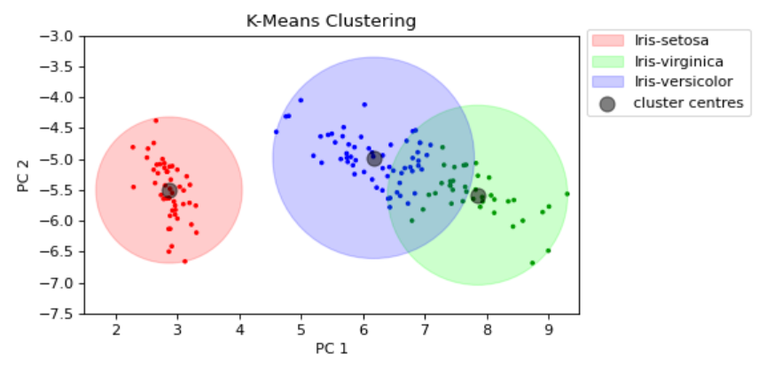
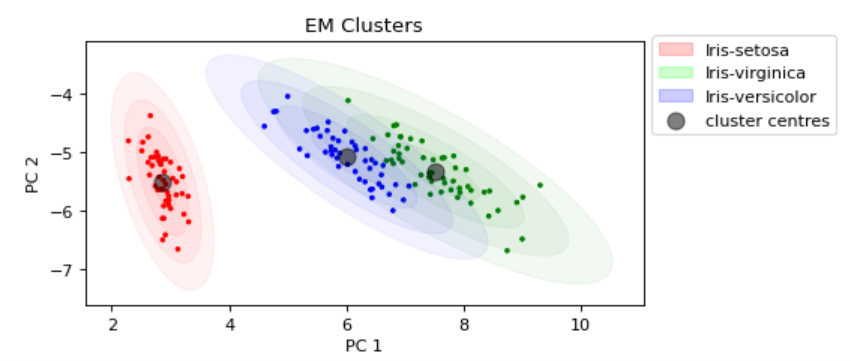

# IrisMachineLearning

The purpose of this project, which was part of a machine learning module at university, was to categorise 
iris plants based off of 4 features: their sepal length and width in cm, and their petal length and width in cm.  

First I perform principal component analysis to reduce the dimensions to only 2 features. Next I fit the 
data using a K-Means model. This is used to get the initial parameters for performing the expectation-maximization 
algorithm, which is done using my own implementation of the algorithm.  

The data fitted with K-Means:  

VS. the data fitted with the EM algorithm:  

  

As you can see, the EM algorithm does a much better job fitting the data and is therefore better for predicting 
the labels of new test data.
